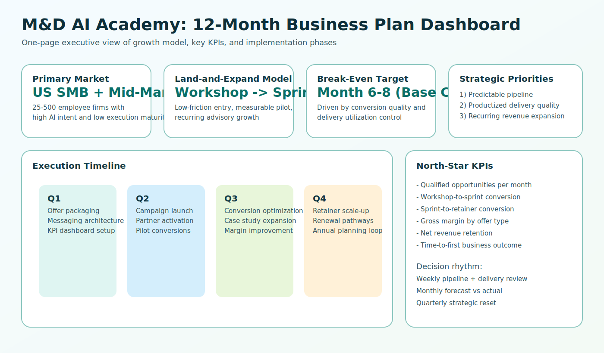
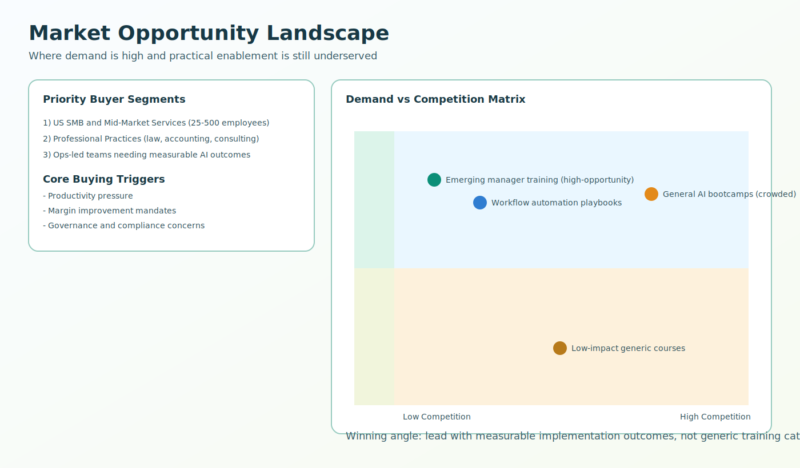
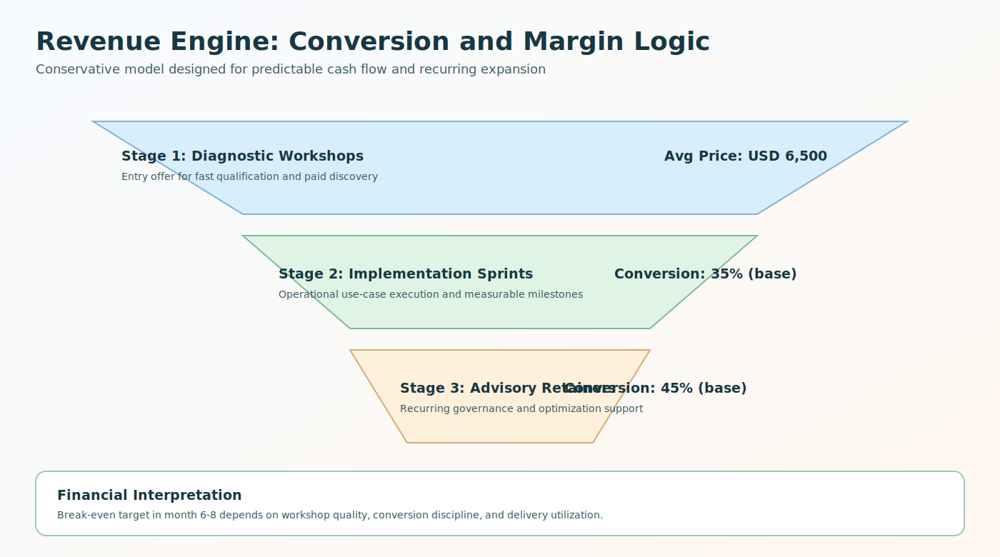
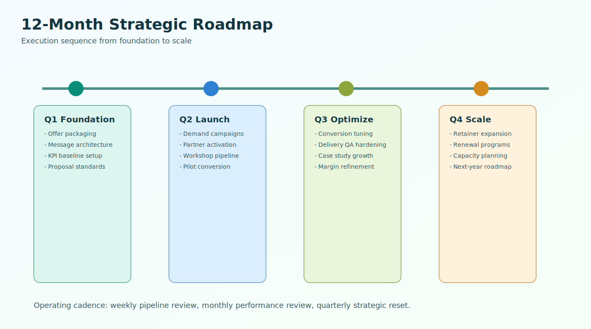

# Master Business Planning Document: M&D AI Academy AI Consulting and Training

This consolidated document combines the four planning tracks into one executive package:

- Market Analysis
- Financial Projections
- Go-to-Market Strategy
- Strategic Plan

## Executive Visual Overview

## Plan Portfolio at a Glance

| Plan | Primary Purpose | Core Outcome | Source Document |
|---|---|---|---|
| Market Analysis | Validate demand and positioning | Identify high-opportunity segments and differentiators | `docs/bp/20260213-market-analysis-mdai-ai-consulting-training.md` |
| Financial Projections | Define economics and break-even path | Build predictable, margin-aware growth model | `docs/bp/20260213-financial-projections-mdai-ai-consulting-training.md` |
| Go-to-Market Strategy | Execute acquisition and conversion | Create repeatable workshop -> sprint -> retainer motion | `docs/bp/20260213-go-to-market-strategy-mdai-ai-consulting-training.md` |
| Strategic Plan | Align long-term direction and execution | Establish quarterly objectives and KPI governance | `docs/bp/20260213-strategic-plan-mdai-ai-consulting-training.md` |

## 1) Market Opportunity Summary

The strongest near-term demand comes from US SMB and mid-market organizations with high AI intent but low implementation maturity. Buyers want practical adoption support tied to measurable business outcomes.

### Strategic Market Insight

- Competing on generic training creates price pressure.
- Differentiating on practical outcomes and implementation quality improves win probability.
- Vertical-specific messaging is required for conversion efficiency.

## 2) Financial Model Summary

The growth engine is intentionally staged:

1. Paid diagnostic workshop (entry)
2. Implementation sprint (value realization)
3. Advisory retainer (recurring expansion)

### Base-Case Economics (Conservative)

- Break-even target: month 6-8
- Key levers: conversion quality, utilization, and scope discipline
- Financial governance: monthly forecast-vs-actual with channel-level CAC monitoring

## 3) Go-to-Market Summary

The GTM system uses a two-lane motion:

- Executive advisory lane for decision-makers
- Team enablement lane for practical adoption

This approach reduces buying friction while preserving expansion potential into implementation and retainer services.

### Channel Mix

- Thought leadership and educational events
- Partner referrals
- Targeted outbound to operations and executive roles

## 4) Strategic Execution Summary

Execution is structured by quarter to preserve focus and accountability.

### Year-One Milestone Arc

- Q1: Foundation and operating system setup
- Q2: Launch demand and convert first wave
- Q3: Optimize conversion and delivery margins
- Q4: Scale retainers and lock renewal pathways

## 5) Integrated KPI Framework

### Growth KPIs

- Qualified opportunities per month
- Workshop booking rate
- Workshop-to-sprint conversion
- Sprint-to-retainer conversion

### Financial KPIs

- Revenue by offer type
- Gross margin by offer type
- CAC and payback period
- Net revenue retention

### Delivery KPIs

- On-time milestone completion
- Time-to-first measurable outcome
- Client satisfaction and reference rate

## 6) Top Risks Across All Plans

- Weak differentiation in a crowded services market
- Conversion leakage between sales stages
- Scope creep reducing delivery margins
- Capacity constraints during growth phases

## 7) Consolidated Next Steps (30-60-90)

### First 30 Days

- Finalize vertical priorities and offer packaging
- Standardize pricing and proposal templates
- Stand up KPI dashboard and review cadence

### Day 31-60

- Launch first campaign cycle and partner outreach
- Run initial paid diagnostics
- Validate assumptions against early pipeline data

### Day 61-90

- Optimize conversion stages and delivery SOPs
- Publish first client case studies
- Re-forecast financial model using actual results

## Linked Plan Files

- `docs/bp/20260213-market-analysis-mdai-ai-consulting-training.md`
- `docs/bp/20260213-financial-projections-mdai-ai-consulting-training.md`
- `docs/bp/20260213-go-to-market-strategy-mdai-ai-consulting-training.md`
- `docs/bp/20260213-strategic-plan-mdai-ai-consulting-training.md`

Document last updated on 2026-02-13. Verified against project logs, deliverables tracking, and communication archives.
