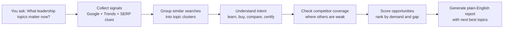
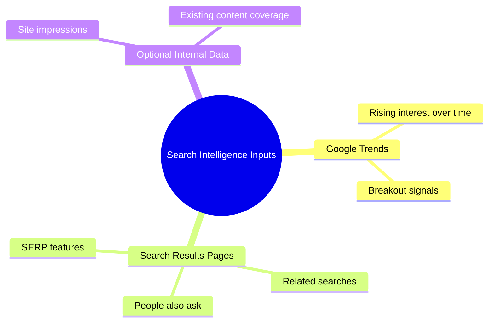
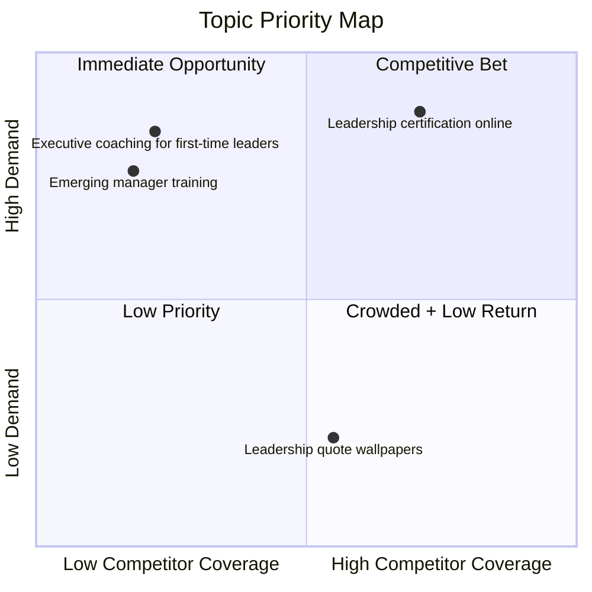
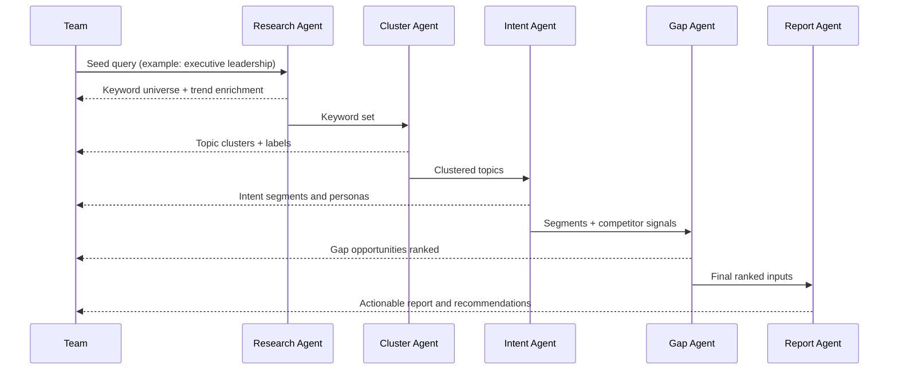
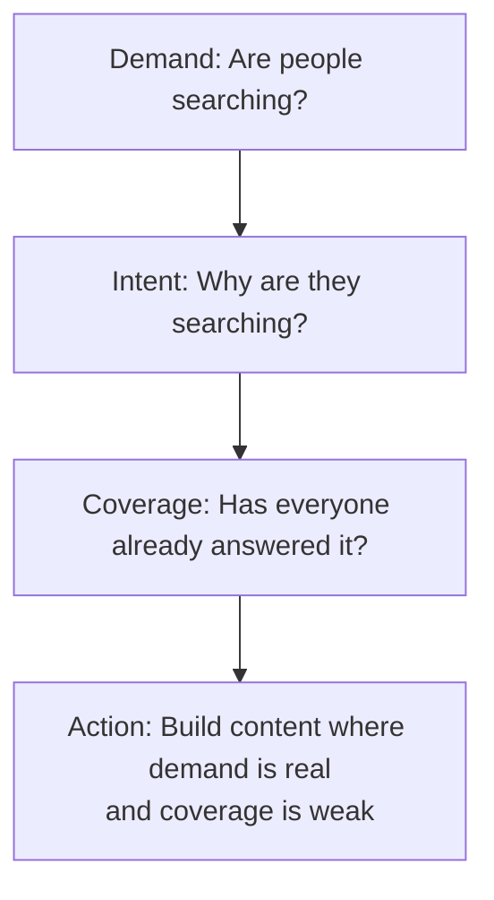

# Process Infographics (Layman-Friendly)

This page explains how the platform turns raw search signals into practical topic recommendations.

Use this visual in presentations, onboarding, and stakeholder updates.

## 1) Big Picture: From Question to Report

## 2) Data Inputs Explained in Plain English

## 3) How Topic Prioritization Works

Think of this like a triage board:

- High demand + low competitor coverage = highest priority
- High demand + high coverage = competitive but still valuable
- Low demand + low coverage = monitor, do not prioritize

## 4) What the Pipeline Does at Each Stage

## 5) A Simple Mental Model

## 6) How to Read Final Recommendations

- Start with topics that are both rising and under-covered.
- Prefer clusters with clear buyer or learner intent.
- Use breakout topics for short-term campaigns.
- Use steady-demand topics for evergreen content.

## Reusable Asset

- Source graphic: `visualizations/pipeline-overview.svg`
- Recommended embed: ``
