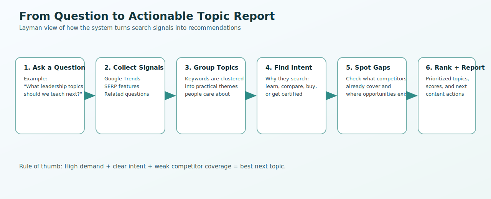

# User Guide

This guide explains how to run the platform and interpret results without requiring deep technical knowledge.

## What This System Does

Leadership Topic Intelligence helps you answer a simple question:

"What leadership topics should we prioritize now?"

It does this by combining search demand, trend momentum, and competitor coverage into ranked recommendations.



## Quick Start

```bash
python -m venv .venv
source .venv/bin/activate
pip install -r requirements.txt
cp .env.example .env
mkdir -p data logs outputs reports visualizations
python run.py --task full -q "executive leadership"
```

## Choose the Right Task

- `research`: gather and enrich keywords
- `cluster`: group keywords into topic families
- `gaps`: analyze competitor coverage and opportunities
- `full`: run the full pipeline and generate a report

Example:

```bash
python run.py --task gaps -q "executive communication"
```

## How to Read Output

After each run, check these outputs:

- `reports/`: final markdown report with recommendations
- `outputs/`: session metadata and result summaries
- `logs/`: execution logs for troubleshooting

## Interpreting Priority Signals

Use these rules of thumb:

- High demand + low coverage = immediate opportunity
- High demand + high coverage = competitive but valuable
- Low demand + low coverage = monitor, not urgent

For additional visuals and process explanations, see `docs/process-infographics.md`.

For business planning visuals and executive-ready strategy documentation, see:

- `docs/bp/20260213-master-business-plan-mdai-ai-consulting-training.md`
- `visualizations/bp-executive-dashboard.svg`

## Common Commands

Run tests:

```bash
PYTHONPATH=src pytest tests/unit/ -v --tb=short
```

Run one test file:

```bash
PYTHONPATH=src pytest tests/unit/test_config.py -v
```

Run one test function:

```bash
PYTHONPATH=src pytest tests/unit/test_config.py::test_settings_defaults -v
```

## Troubleshooting

- If API-based data is unavailable, ensure `.env` keys are set.
- For deterministic local validation, use `NO_NETWORK_MODE=true`.
- If directories are missing, recreate with `mkdir -p data logs outputs reports visualizations`.
